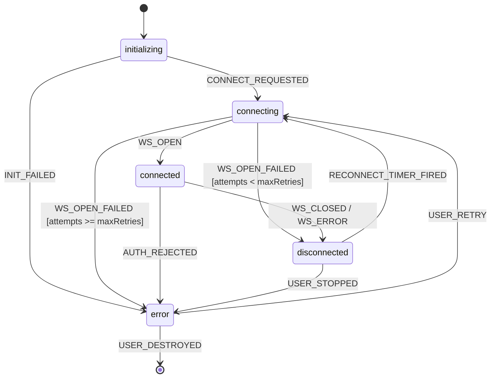
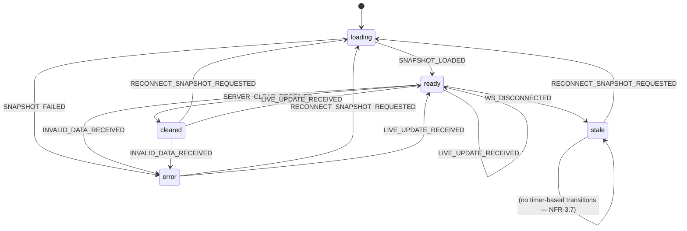
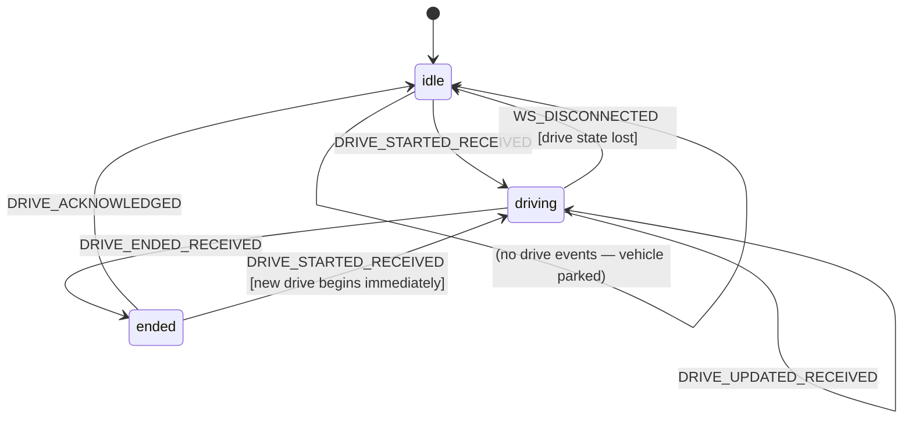
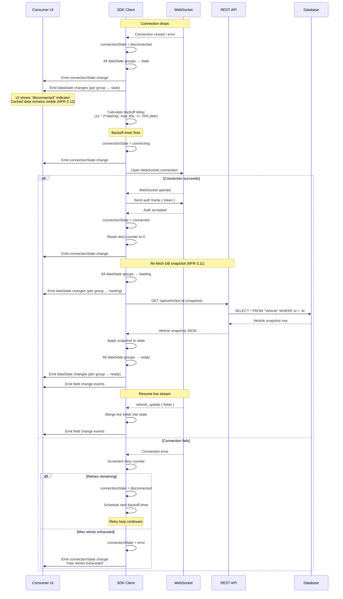

# State Machine Contract

**Status:** Draft — v1
**Target artifact:** State diagrams + transition tables
**Owner:** `sdk-architect` agent
**Last updated:** 2026-04-12

## Purpose

Formalizes the two independent state dimensions the SDK exposes to consumers — **`connectionState`** (transport health) and **`dataState`** (per-atomic-group freshness) — plus the **drive lifecycle** state machine. This contract is shared verbatim by the TypeScript and Swift SDKs so both expose identical state transitions, guards, actions, and event mappings.

The SDK never collapses these dimensions into a single enum (FR-8.2). The UI composes them to derive display states (e.g., "connected but GPS stale" or "disconnected with cached charge data").

## Anchored requirements

| ID | Requirement | Relevance |
|----|-------------|-----------|
| **FR-8.1** | SDK MUST expose two independent state dimensions: `connectionState` (`initializing \| connecting \| connected \| disconnected \| error`) and `dataState` per atomic group (`loading \| ready \| stale \| cleared \| error`) | Defines the two primary state machines |
| **FR-8.2** | UI composes the two dimensions; SDK never collapses them into a single enum | Architectural constraint on state design |
| **FR-3.1** | SDK MUST emit live drive events: `drive_started`, `drive_updated`, `drive_ended` | Defines the drive lifecycle state machine |
| **NFR-3.7** | Freshness is event-driven, NOT time-based. SDK MUST NOT use client-side TTL timers to mark data stale | Constrains `dataState` transitions — no timer-based staleness |
| **NFR-3.8** | Data is stale only when: (a) server explicitly signaled a clear, or (b) WebSocket is disconnected | Enumerates the only two triggers for `ready → stale` |
| **NFR-3.9** | When server marks a field invalid, SDK MUST apply the clear atomically within the affected group | Defines the `ready → cleared` transition |
| **NFR-3.10** | SDK MUST support automatic reconnect with exponential backoff (initial 1s, max 30s, jitter) | Defines reconnect parameters for `connectionState` |
| **NFR-3.11** | On reconnect, SDK MUST re-fetch DB snapshot and resume live stream without user intervention | Defines the snapshot-resume sequence |
| **NFR-3.12** | SDK MUST gracefully tolerate offline: cached state from DB visible, connection state signals to UI, no forced reloads | Constrains offline behavior |
| **NFR-3.13** | Offline tolerance: no maximum — cached data visible indefinitely | No expiry on cached data |

---

## 1. `connectionState` state machine

The `connectionState` dimension tracks the health of the WebSocket transport between the SDK and the telemetry server. It is a single value for the entire SDK instance (not per-vehicle or per-group).

### 1.1 State diagram



### 1.2 States

| State | Description |
|-------|-------------|
| `initializing` | SDK instance created; loading configuration, validating auth token, preparing WebSocket URL. No network activity yet. |
| `connecting` | WebSocket connection attempt in progress. Includes both initial connection and reconnection attempts. |
| `connected` | WebSocket is open, authenticated, and actively receiving server messages. This is the only state where live telemetry flows. |
| `disconnected` | WebSocket was closed (cleanly or due to error). Automatic reconnection is scheduled. Cached data remains visible (NFR-3.12, NFR-3.13). |
| `error` | Terminal or semi-terminal state: authentication was rejected, maximum retries exhausted, or the SDK was explicitly stopped. Requires user action (`USER_RETRY` or `USER_DESTROYED`) to leave. |

### 1.3 Transition table

| # | Current State | Event | Guard | Next State | Action(s) |
|---|---------------|-------|-------|------------|-----------|
| C-1 | `initializing` | `CONNECT_REQUESTED` | Auth token valid | `connecting` | Open WebSocket connection to server |
| C-2 | `initializing` | `INIT_FAILED` | Config invalid or auth token missing/expired | `error` | Emit `connectionState` change; set error reason |
| C-3 | `connecting` | `WS_OPEN` | Server accepts connection + auth handshake succeeds | `connected` | Emit `connectionState` change; reset retry counter to 0; start heartbeat |
| C-4 | `connecting` | `WS_OPEN_FAILED` | `attempts < maxRetries` | `disconnected` | Increment retry counter; schedule reconnect timer with backoff |
| C-5 | `connecting` | `WS_OPEN_FAILED` | `attempts >= maxRetries` | `error` | Emit `connectionState` change; set error reason "max retries exhausted" |
| C-6 | `connected` | `WS_CLOSED` | -- | `disconnected` | Mark all `dataState` groups as `stale` (NFR-3.8b); schedule reconnect timer |
| C-7 | `connected` | `WS_ERROR` | -- | `disconnected` | Mark all `dataState` groups as `stale` (NFR-3.8b); schedule reconnect timer |
| C-8 | `connected` | `AUTH_REJECTED` | Server sends auth error frame | `error` | Emit `connectionState` change; set error reason; close WebSocket |
| C-9 | `disconnected` | `RECONNECT_TIMER_FIRED` | -- | `connecting` | Open WebSocket connection to server |
| C-10 | `disconnected` | `USER_STOPPED` | User explicitly stops the SDK | `error` | Cancel reconnect timer; emit `connectionState` change |
| C-11 | `error` | `USER_RETRY` | -- | `connecting` | Reset retry counter to 0; open WebSocket connection |
| C-12 | `error` | `USER_DESTROYED` | -- | (terminal) | Release all resources; unsubscribe all listeners |

### 1.4 Reconnect backoff parameters (NFR-3.10)

| Parameter | Value | Notes |
|-----------|-------|-------|
| Initial delay | 1 second | First reconnect attempt after disconnect |
| Backoff multiplier | 2x | Each subsequent attempt doubles the delay |
| Maximum delay | 30 seconds | Delay is capped at 30s regardless of attempt count |
| Jitter | +/- 25% of computed delay | Prevents thundering herd when many clients reconnect simultaneously |
| Maximum retries | Unlimited (default) | SDK retries indefinitely unless `USER_STOPPED` or consumer configures a limit |

**Backoff formula:**

```
delay = min(initialDelay * 2^(attempt - 1), maxDelay)
jitter = delay * random(-0.25, +0.25)
effectiveDelay = delay + jitter
```

---

## 2. `dataState` per-group state machine

The `dataState` dimension tracks the freshness of data within each atomic group independently. There is one `dataState` instance per atomic group per vehicle:

- **GPS group:** `latitude`, `longitude`, `heading`
- **Gear group:** `gearPosition`, `status`
- **Charge group:** `chargeLevel`, `estimatedRange`
- **Navigation group:** `destinationName`, `destinationAddress`, `destinationLatitude`, `destinationLongitude`, `originLatitude`, `originLongitude`, `etaMinutes`, `tripDistanceRemaining`, `navRouteCoordinates`

> See `vehicle-state-schema.md` Section 2 for complete atomic group definitions and consistency predicates.

### 2.1 State diagram



### 2.2 States

| State | Description | Cached data visible? |
|-------|-------------|---------------------|
| `loading` | Initial snapshot is being fetched from DB (cold load or reconnect). No data available yet for this group. | No (first load) or Yes (reconnect — previous cached values remain visible per NFR-3.12) |
| `ready` | Data is fresh. Either the DB snapshot was loaded or a live WebSocket update was received. | Yes |
| `stale` | WebSocket disconnected (NFR-3.8b). Data may be outdated but remains visible (NFR-3.12, NFR-3.13). The SDK MUST NOT use client-side TTL timers to transition to `stale` (NFR-3.7). | Yes — cached data visible indefinitely (NFR-3.13) |
| `cleared` | Server explicitly signaled that the fields in this group are invalid (NFR-3.8a, NFR-3.9). Example: navigation cancelled — all nav fields cleared atomically. | No — fields in this group are null/empty |
| `error` | An error occurred loading or processing data for this group: snapshot fetch failed, data validation failed, or the server sent malformed data. | Previous cached values may be visible if they existed before the error |

### 2.3 Transition table

| # | Current State | Event | Guard | Next State | Action(s) |
|---|---------------|-------|-------|------------|-----------|
| D-1 | `loading` | `SNAPSHOT_LOADED` | Snapshot contains valid data for this group | `ready` | Populate group fields from snapshot; emit `dataState` change |
| D-2 | `loading` | `SNAPSHOT_FAILED` | Fetch error or timeout | `error` | Emit `dataState` change; set error reason |
| D-3 | `ready` | `LIVE_UPDATE_RECEIVED` | Update contains fields in this group | `ready` | Merge fields into current state; emit field change events |
| D-4 | `ready` | `WS_DISCONNECTED` | `connectionState` transitioned to `disconnected` | `stale` | Emit `dataState` change; do NOT clear cached values (NFR-3.12, NFR-3.13) |
| D-5 | `ready` | `SERVER_CLEAR_RECEIVED` | Server sent an explicit field-invalid signal for this group | `cleared` | Atomically null all fields in this group (NFR-3.9); emit `dataState` change |
| D-6 | `ready` | `INVALID_DATA_RECEIVED` | Data fails consistency predicates (see `vehicle-state-schema.md` Section 3) | `error` | Log error; emit `dataState` change; retain last-known-good values |
| D-7 | `stale` | `RECONNECT_SNAPSHOT_REQUESTED` | `connectionState` transitioned to `connecting` (reconnect) | `loading` | Begin snapshot re-fetch (NFR-3.11); cached data remains visible during fetch |
| D-8 | `cleared` | `RECONNECT_SNAPSHOT_REQUESTED` | `connectionState` transitioned to `connecting` (reconnect) | `loading` | Begin snapshot re-fetch |
| D-9 | `cleared` | `LIVE_UPDATE_RECEIVED` | WebSocket delivers new data for this group | `ready` | Populate group fields; emit `dataState` change |
| D-10 | `cleared` | `INVALID_DATA_RECEIVED` | Data fails consistency predicates (see `vehicle-state-schema.md` Section 3) | `error` | Log error; emit `dataState` change |
| D-11 | `error` | `RECONNECT_SNAPSHOT_REQUESTED` | Reconnect initiated | `loading` | Retry snapshot fetch |
| D-12 | `error` | `LIVE_UPDATE_RECEIVED` | WebSocket delivers valid data for this group | `ready` | Populate group fields; emit `dataState` change |

### 2.4 Critical constraints

1. **No client-side TTL timers (NFR-3.7).** The SDK MUST NOT use `setTimeout`, `Timer`, or any time-based mechanism to transition data from `ready` to `stale`. Staleness is signaled ONLY by WebSocket disconnection (NFR-3.8b) or server-initiated clear (NFR-3.8a).

2. **Indefinite cache visibility (NFR-3.13).** When in `stale` state, cached data remains visible to the UI with no expiration. There is no "too old to show" threshold. The `dataState` value tells the UI the data may be outdated; the UI decides how to render it.

3. **Atomic clears per group (NFR-3.9).** When the server signals a clear for any field in a group, ALL fields in that group transition to null simultaneously. There is no partial clear within a group.

4. **Per-group independence.** Each group transitions independently. A navigation clear (`cleared`) does not affect the GPS group (`ready`). A WebSocket disconnect moves ALL groups to `stale` simultaneously.

---

## 3. Drive lifecycle state machine

The drive lifecycle state machine tracks whether a vehicle is currently on a drive. It is maintained per-vehicle and is driven by server-side drive detection events published over the WebSocket.

### 3.1 State diagram



### 3.2 States

| State | Description |
|-------|-------------|
| `idle` | Vehicle is not currently driving. Gear is P, N, or unknown. No active drive events are being emitted. |
| `driving` | Vehicle is actively driving. The SDK is receiving `drive_updated` events with route points, speed, and heading. Drive statistics are being accumulated server-side. |
| `ended` | A drive has completed. The SDK has received a `drive_ended` event with summary statistics. This is a transient state: the UI processes the drive summary and the state returns to `idle`. |

### 3.3 Transition table

| # | Current State | Event | Guard | Next State | Action(s) |
|---|---------------|-------|-------|------------|-----------|
| DR-1 | `idle` | `DRIVE_STARTED_RECEIVED` | Server sent `drive_started` message | `driving` | Store drive ID, start location, timestamp; emit `drive_started` to consumers |
| DR-2 | `driving` | `DRIVE_UPDATED_RECEIVED` | Server sent `drive_updated` (vehicle_update with route point during active drive) | `driving` | Append route point to current drive; emit `drive_updated` to consumers |
| DR-3 | `driving` | `DRIVE_ENDED_RECEIVED` | Server sent `drive_ended` message (drive passed micro-drive filter) | `ended` | Store drive summary stats; emit `drive_ended` to consumers |
| DR-4 | `driving` | `WS_DISCONNECTED` | WebSocket disconnected during active drive | `idle` | Clear in-memory drive state; the server will persist the drive if it meets thresholds. On reconnect, the completed drive (if any) will be available via REST. |
| DR-5 | `ended` | `DRIVE_ACKNOWLEDGED` | Consumer has processed the drive summary | `idle` | Clear drive summary from state |
| DR-6 | `ended` | `DRIVE_STARTED_RECEIVED` | New drive begins before consumer acknowledged previous | `driving` | Replace previous drive summary; store new drive data; emit `drive_started` |

### 3.4 Server-side drive detection (context)

The SDK does not detect drives itself. The Go telemetry server's `internal/drives/` package maintains a per-vehicle state machine that detects drive start/end transitions from gear telemetry:

- **Idle to Driving:** Gear shifts to `D` or `R`
- **Driving to Idle:** Gear shifts to `P` and the debounce timer (default 30s) elapses without a return to `D`/`R`
- **Debounce cancellation:** If gear returns to `D`/`R` before the debounce timer fires, the drive continues

The server publishes drive events to the internal event bus, and the WebSocket broadcaster transforms them into client-facing messages.

### 3.5 Micro-drive filter

Drives that are too short to be meaningful are suppressed by the server before `drive_ended` is sent to clients. A drive is discarded as a "micro-drive" if either threshold is not met:

| Parameter | Default | Description |
|-----------|---------|-------------|
| `MinDuration` | 2 minutes | Drive must last at least this long |
| `MinDistanceMiles` | 0.1 miles (~528 feet) | Drive must cover at least this distance (haversine sum of route points) |

When a micro-drive is discarded:
1. The server resets the vehicle's drive state to idle
2. **No `drive_ended` event is sent** to the SDK/clients
3. The SDK transitions from `driving` back to `idle` implicitly when no further drive events arrive (or explicitly on WebSocket disconnect)
4. The micro-drive is not persisted to the database

> **SDK behavior on suppressed micro-drives:** The SDK will have received a `drive_started` event but will never receive a corresponding `drive_ended`. When the WebSocket disconnects, the SDK resets to `idle` (transition DR-4). The SDK SHOULD expose an optional timeout or mechanism for the UI to handle this edge case (e.g., if the drive state has been `driving` for an extended period without updates and the connection is still active, the UI may choose to show a "drive may have ended" indicator). However, this is a UI concern — the SDK state machine itself does not use client-side timers for drive detection per NFR-3.7.

---

## 4. Server event to state transition mapping

This section maps every WebSocket server message type to the state transitions it triggers across all three state machines.

### 4.1 Server message types

| Message Type | Wire Value | Payload Shape | Source |
|--------------|-----------|---------------|--------|
| Vehicle update | `vehicle_update` | `{ vehicleId, fields, timestamp }` | Telemetry event on bus |
| Drive started | `drive_started` | `{ vehicleId, driveId, startLocation, timestamp }` | Drive detector |
| Drive ended | `drive_ended` | `{ vehicleId, driveId, distance, duration, avgSpeed, maxSpeed, timestamp }` | Drive detector (post micro-drive filter). See note below. |
| Connectivity | `connectivity` | `{ vehicleId, online, timestamp }` | Vehicle mTLS connection state |
| Heartbeat | `heartbeat` | (empty or `{ timestamp }`) | Server keepalive |
| Error | `error` | `{ code, message }` | Server error |
| Auth | `auth` | `{ token }` | Client-to-server only |

> **`drive_ended` payload scope.** The WebSocket `drive_ended` payload contains summary fields for immediate UI feedback. The full drive record with all FR-3.4 fields (energy used, FSD miles, intervention count, start/end charge level, start/end location + address) is available via the REST drive detail endpoint (see `rest-api.md`). SDK consumers that need the complete drive record should fetch it via REST after receiving `drive_ended`.

> **`drive_updated` is not a distinct wire message.** During an active drive, the SDK interprets incoming `vehicle_update` messages containing GPS route point fields as drive updates. The SDK emits `drive_updated` to consumers as a logical event, but the wire carries `vehicle_update`. Do not look for a `"drive_updated"` message type string on the wire.

### 4.2 Event-to-transition mapping

| Server Event | `connectionState` Transition | `dataState` Transition(s) | Drive Lifecycle Transition |
|--------------|------------------------------|---------------------------|---------------------------|
| WebSocket opened + auth accepted | `connecting → connected` (C-3) | -- (snapshot fetch begins separately) | -- |
| WebSocket open failed | `connecting → disconnected` (C-4) or `connecting → error` (C-5) | -- | -- |
| WebSocket closed (clean) | `connected → disconnected` (C-6) | ALL groups: `ready → stale` (D-4) | If driving: `driving → idle` (DR-4) |
| WebSocket error (transport) | `connected → disconnected` (C-7) | ALL groups: `ready → stale` (D-4) | If driving: `driving → idle` (DR-4) |
| Auth rejected (`error` with `auth_failed`) | `connected → error` (C-8) | -- | -- |
| `vehicle_update` (normal fields) | -- | Per-group: `ready → ready` (D-3) or `cleared → ready` (D-9) or `error → ready` (D-12) | -- |
| `vehicle_update` (field-invalid / clear) | -- | Affected group: `ready → cleared` (D-5) | -- |
| `drive_started` | -- | -- | `idle → driving` (DR-1) or `ended → driving` (DR-6) |
| `drive_updated` (route point in `vehicle_update`) | -- | GPS group: `ready → ready` (D-3) | `driving → driving` (DR-2) |
| `drive_ended` | -- | -- | `driving → ended` (DR-3) |
| `connectivity` (`online: true`) | -- | -- (server-side only; SDK connectionState already handles this via WS_OPEN) | -- |
| `connectivity` (`online: false`) | -- | -- (vehicle-to-server disconnect; does not directly affect SDK client connection) | -- |
| `heartbeat` | -- (resets keepalive watchdog) | -- | -- |
| Snapshot loaded (REST/DB) | -- | Per-group: `loading → ready` (D-1) | -- |
| Snapshot failed (REST/DB) | -- | Per-group: `loading → error` (D-2) | -- |

### 4.3 Field-to-group routing

When a `vehicle_update` message arrives, the SDK routes each field in the `fields` map to its atomic group and triggers the appropriate `dataState` transition for that group:

| Field(s) in `vehicle_update` | Atomic Group | `dataState` Affected |
|------------------------------|-------------|---------------------|
| `latitude`, `longitude`, `heading` | GPS | `dataState.gps` |
| `gearPosition`, `status` | Gear | `dataState.gear` |
| `chargeLevel`, `estimatedRange` | Charge | `dataState.charge` |
| `destinationName`, `destinationAddress`, `destinationLatitude`, `destinationLongitude`, `originLatitude`, `originLongitude`, `etaMinutes`, `tripDistanceRemaining`, `navRouteCoordinates` | Navigation | `dataState.navigation` |
| `speed`, `odometerMiles`, `interiorTemp`, `exteriorTemp`, `fsdMilesToday`, `locationName`, `locationAddress` | (ungrouped) | No `dataState` dimension — these fields update individually |

> **Ungrouped fields** do not participate in the `dataState` model. They are updated directly in the vehicle state object when received. Their freshness is implied by `connectionState`: if connected, they are fresh; if disconnected, they are stale alongside everything else.

---

## 5. Reconnect sequence

When the WebSocket connection drops, the SDK executes an automatic reconnect sequence that re-fetches the DB snapshot and resumes the live stream without user intervention (NFR-3.11).

### 5.1 Sequence diagram



### 5.2 Reconnect invariants

1. **Snapshot before stream (NFR-3.11).** On reconnect, the SDK MUST fetch the DB snapshot before processing any new WebSocket events. This ensures the client has a consistent baseline — the DB snapshot is the cold-load SoT (see `data-lifecycle.md` Section 1.2).

2. **No forced reloads (NFR-3.12).** The reconnect sequence is entirely SDK-internal. The UI is never asked to reload the page or restart the app. The SDK handles snapshot re-fetch and live stream resume transparently.

3. **Cached data during reconnect (NFR-3.12, NFR-3.13).** While the snapshot is being re-fetched (groups in `loading`), previously cached data remains visible in the UI. The `dataState` value (`loading`) tells the UI that fresh data is being loaded, but the last-known values are still available.

4. **Ordering guarantee.** The SDK MUST NOT apply live WebSocket updates for a group until the snapshot for that group has been applied. If live updates arrive before the snapshot fetch completes, they are queued and applied after the snapshot.

5. **Idempotent reconnect.** Multiple rapid disconnect/reconnect cycles MUST NOT cause duplicate snapshot fetches or event deliveries. The SDK cancels any in-flight snapshot fetch when a new reconnect begins.

---

## 6. Consumer usage examples

These examples show how a UI composes `connectionState` and `dataState` to derive display states. They are conceptual patterns, not implementation code.

### 6.1 Connection status banner

| `connectionState` | UI Behavior |
|-------------------|-------------|
| `initializing` | Show loading spinner or skeleton UI |
| `connecting` | Show "Connecting..." indicator |
| `connected` | Hide connection banner (or show green indicator) |
| `disconnected` | Show "Reconnecting..." banner with subtle animation |
| `error` | Show "Connection failed" banner with retry button |

### 6.2 Per-group data freshness

| `connectionState` | `dataState` (group) | UI Behavior |
|-------------------|---------------------|-------------|
| `connected` | `loading` | Show skeleton/placeholder for this group |
| `connected` | `ready` | Show live data with full confidence |
| `connected` | `cleared` | Show "N/A" or empty state (e.g., "No active navigation") |
| `connected` | `error` | Show error indicator for this group; other groups unaffected |
| `disconnected` | `stale` | Show cached data with "Last updated X ago" indicator |
| `disconnected` | `cleared` | Show "N/A" — field was explicitly cleared before disconnect |
| `error` | `stale` | Show cached data with "Offline" indicator + retry button |

### 6.3 Composing GPS + connection for map display

```
if connectionState == connected && dataState.gps == ready:
    Show live marker on map (full opacity, animate movement)

if connectionState == disconnected && dataState.gps == stale:
    Show last-known marker (reduced opacity, "Last seen" tooltip)

if dataState.gps == loading:
    Show map without marker (or centered on default location)

if dataState.gps == error:
    Show map with error overlay for position
```

### 6.4 Navigation group composition

```
if dataState.navigation == ready:
    Show destination, ETA, route polyline, trip distance remaining

if dataState.navigation == cleared:
    Show "No active navigation" — user cancelled or route completed

if dataState.navigation == stale:
    Show last-known route with staleness indicator
    (route may no longer be active)
```

### 6.5 Drive lifecycle composition

```
if driveState == idle:
    Show vehicle status card (parked / charging / offline)

if driveState == driving:
    Show live drive UI: route animation, speed, distance,
    elapsed time, drive ID

if driveState == ended:
    Show drive summary card (distance, duration, avg speed, max speed)
    On dismiss → driveState returns to idle
```

---

## 7. Contract-guard rules

The `contract-guard` agent/CI check enforces the following rules derived from this document. These rules apply to both the TypeScript and Swift SDK implementations.

### Rule CG-SM-1: No client-side TTL for staleness

**Trigger:** Any PR that modifies SDK state management code.

**Check:** The SDK MUST NOT use `setTimeout`, `Timer`, `DispatchWorkItem`, or any time-based mechanism to transition `dataState` from `ready` to `stale`. The only permitted triggers for `ready → stale` are (a) WebSocket disconnection and (b) server-initiated clear. This enforces NFR-3.7.

**Violation examples:**
- `setTimeout(() => setDataState('stale'), 30000)` — client-side TTL
- `Timer.scheduledTimer(withTimeInterval: 30, ...)` to mark data stale
- A "freshness timeout" configuration option in the SDK

**Fix:** Remove the timer. Staleness is event-driven per NFR-3.7, NFR-3.8.

### Rule CG-SM-2: Two independent state dimensions

**Trigger:** Any PR that modifies SDK public API surface or state types.

**Check:** The SDK MUST expose `connectionState` and `dataState` as independent values. No combined enum (e.g., `ConnectionStatus.connectedButStale`) or single state type that collapses both dimensions is permitted. This enforces FR-8.1 and FR-8.2.

**Violation examples:**
- `type SdkState = 'connected' | 'connected-stale' | 'disconnected-cached'`
- A single `status` property that merges connection and data freshness

**Fix:** Expose two separate state accessors. The UI composes them.

### Rule CG-SM-3: Atomic group clears

**Trigger:** Any PR that handles server clear/invalid signals in the SDK.

**Check:** When the SDK receives a server-initiated clear for any field in an atomic group, it MUST atomically null ALL fields in that group — not just the field(s) named in the clear signal. Partial clears within an atomic group are never valid. This enforces NFR-3.9.

**Violation examples:**
- Clearing `destinationName` without also clearing `destinationLatitude`, `destinationLongitude`, `navRouteCoordinates`, etc.
- Clearing `chargeLevel` without also clearing `estimatedRange`

**Fix:** Apply the clear to the entire atomic group per `vehicle-state-schema.md` Section 2.

### Rule CG-SM-4: Reconnect must re-fetch snapshot

**Trigger:** Any PR that modifies WebSocket reconnection logic in the SDK.

**Check:** On every reconnect, the SDK MUST re-fetch the DB snapshot via the REST API before processing new live WebSocket events. Resuming the live stream without re-establishing the DB baseline is not permitted. This enforces NFR-3.11.

**Violation examples:**
- Reconnecting and immediately processing WebSocket events without a snapshot fetch
- Using only cached data after reconnect, skipping the DB round-trip

**Fix:** Follow the reconnect sequence in Section 5: connect, authenticate, fetch snapshot, apply snapshot, then process live events.

### Rule CG-SM-5: Cached data visible during offline

**Trigger:** Any PR that modifies SDK disconnect handling or data display logic.

**Check:** When `connectionState` is `disconnected`, all previously cached vehicle state data MUST remain accessible to the UI. The SDK MUST NOT clear data on disconnect. The `dataState` transitions to `stale` (not `cleared`) on disconnect. This enforces NFR-3.12 and NFR-3.13.

**Violation examples:**
- Clearing the vehicle state object on WebSocket close
- Returning `null` for vehicle fields when disconnected
- Setting a maximum offline duration after which data is discarded

**Fix:** On disconnect, set `dataState` to `stale` for all groups. Retain all cached field values. Let the UI decide how to render stale data.

### Rule CG-SM-6: Drive events must match server contract

**Trigger:** Any PR that modifies drive event handling in the SDK.

**Check:** The SDK MUST emit drive lifecycle events (`drive_started`, `drive_updated`, `drive_ended`) only when the corresponding server WebSocket message is received. The SDK MUST NOT synthesize drive events from telemetry data (e.g., detecting drives client-side from gear changes). Drive detection is server-side only. This enforces FR-3.1.

**Violation examples:**
- Client-side gear-change detection to emit `drive_started`
- Synthesizing `drive_ended` based on a timeout without server confirmation
- Using client-side speed thresholds to detect drive start/end

**Fix:** Drive lifecycle events are pass-through from server messages. The SDK transforms the wire format to its public API types but does not add detection logic.

### Rule CG-SM-7: Reconnect backoff parameters

**Trigger:** Any PR that modifies WebSocket reconnection timing in the SDK.

**Check:** The reconnect backoff MUST use: initial delay 1s, multiplier 2x, max delay 30s, jitter +/- 25%. These parameters are specified by NFR-3.10 and MUST NOT be deviated from without a contract amendment.

**Fix:** Use the exact parameters specified in Section 1.4.

---

## 8. Cross-references

| Topic | Document |
|-------|----------|
| Atomic group definitions and consistency predicates | `vehicle-state-schema.md` Sections 2, 3 |
| Field-level classification (P0/P1/P2) | `data-classification.md` |
| Data source-of-truth mapping (DB vs WebSocket) | `data-lifecycle.md` Section 1 |
| Vehicle snapshot overwrite semantics | `data-lifecycle.md` Section 2.1 |
| Retention windows and pruning | `data-lifecycle.md` Section 2 |
| WebSocket message catalog and wire format | `websocket-protocol.md` |
| REST API snapshot endpoint | `rest-api.md` |
| Server-side drive detection design | `docs/design/011-drive-detection.md` |
| Drive detection implementation | `internal/drives/` package |
| WebSocket broadcaster implementation | `internal/ws/broadcaster.go` |
| Functional requirements (FR-3.x, FR-8.x) | `docs/architecture/requirements.md` |
| Non-functional requirements (NFR-3.x) | `docs/architecture/requirements.md` |

---

## Change log

| Date | Change | Author |
|------|--------|--------|
| 2026-04-12 | Initial draft — connectionState, dataState, drive lifecycle state machines; transition tables; server event mapping; reconnect sequence; contract-guard rules | sdk-architect agent |
